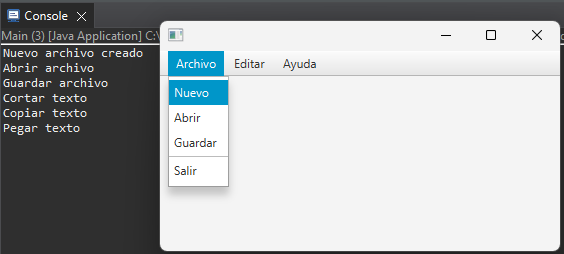
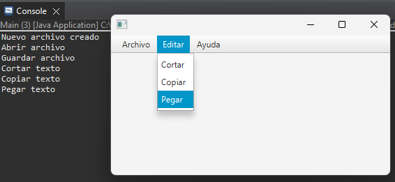
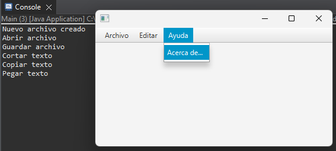
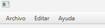
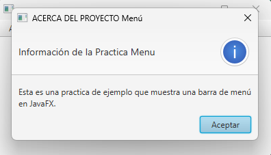

## Proyecto Interfaz Menu
En este proyecto se implementaron distintos menus con java fx segun lo visto en clase a continuación el concepto y sintaxis de cada uno de los menus aplicados en el proyecto. Con su captura de funcionalidad de la interfaz.
Los menús permiten a los usuarios acceder rápidamente a las funcionalidades de la aplicación de manera organizada y jerárquica.
## Imagen de la Interfaz de Menús
##### Menu Archivo:
.
#### Menu Editar:
.
#### Menu Ayuda:
.
### Menu
Cada menú representa una categoría de funcionalidades relacionadas.
Sintaxis:   

         Menu archivoMenu = new Menu("Archivo"); 
	 Menu editarMenu = new Menu("Editar");
         Menu ayudaMenu = new Menu("Ayuda");
#### Se Añadió menús principales como “Archivo”, “Editar”, y “Ayuda”.
.
             
### MenuItem
Cada elemento del menú representa una acción específica que el usuario puede realizar.
#### Sintaxis:

          MenuItem nuevoMenuItem = new MenuItem("Nuevo");
	        MenuItem abrirMenuItem = new MenuItem("Abrir");
	        MenuItem guardarMenuItem = new MenuItem("Guardar");
	        MenuItem salirMenuItem = new MenuItem("Salir");
	        archivoMenu.getItems().addAll(nuevoMenuItem, abrirMenuItem, guardarMenuItem, new SeparatorMenuItem(), salirMenuItem);       
### MenuBar
Es la barra horizontal que se ubica en la parte superior de la ventana de la aplicación y contiene los menús principales.
#### Sintaxis:  

           MenuBar barraMenu = new MenuBar();
	        barraMenu.getMenus().addAll(archivoMenu, editarMenu, ayudaMenu);
### BorderPane
 BorderPane es un layout manager en JavaFX que permite organizar los elementos de la interfaz de usuario (UI) en cinco regiones principales: superior, inferior, izquierda, derecha y centro.
 #### Sintaxis: 

          BorderPane contenido = new BorderPane();
	        BorderPane layout = new BorderPane();
	        layout.setTop(barraMenu);
	        layout.setCenter(contenido);
### SetOnAction

El setOnActionmétodo se utiliza para adjuntar un controlador de acciones a un control en JavaFX. Cuando se activa el control (por ejemplo, se hace clic en un botón), se invoca el controlador de acciones, lo que le permite ejecutar código personalizado en respuesta a la interacción del usuario.
#### Sintaxis:

	        nuevoMenuItem.setOnAction(event -> System.out.println("Nuevo archivo creado"));
	        abrirMenuItem.setOnAction(event -> System.out.println("Abrir archivo"));
	        guardarMenuItem.setOnAction(event -> System.out.println("Guardar archivo"));
	        cortarMenuItem.setOnAction(event -> System.out.println("Cortar texto"));
	        copiarMenuItem.setOnAction(event -> System.out.println("Copiar texto"));
	        pegarMenuItem.setOnAction(event -> System.out.println("Pegar texto"));
	        salirMenuItem.setOnAction(event -> System.exit(0));
	        acercaDeMenuItem.setOnAction(event -> mostrarAcercaDe());
### Metodo AcercaDe
#### Sintaxis:

        // Implementar el contenido de la ventana "Acerca de..."
        Alert alert = new Alert(Alert.AlertType.INFORMATION);
        alert.setTitle("ACERCA DEL PROYECTO Menú ");
        alert.setHeaderText("Información de la Practica Menu");
        alert.setContentText("Esta es una practica de ejemplo que muestra una barra de menú en JavaFX.");
        alert.showAndWait();
#### Imagen de Ejecución del MenuItem Acerca de :
.
        

